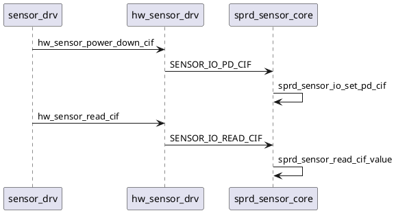

# CIF概述

cif的给我的感觉就是一个光敏电阻，就是要单独供电，当一个单独的设备看即可。

我们当前的项目都是通过去读cif的gpio口的状态，然后根据实际情况是否把这个tag上传给app端，在此基础上完成其相关的需求开发.

# 1 DTS

和正常的设备一样都是需要供电的.

只不过cif模组只要一个io口供电即可.

拿我做过的项目来举例:

我做的项目是供电是借在vddcama1上的.

读取状态的io是接在gpio41上的.所以在对应的dts上需要配置如下相关的内容.

至于这部分内容可以挂在某些camera上暂时未使用的io口.

比如我看到前摄马达这个供电没用，我就顺带映射到马达供电，(如果是gpio 供电，建议招gpio定义的mipi switch io或者其他不占用的io使用)而不是单独做一个。虽然不规范，但是很实用.

同理映射io也建议使用未占用的口. 我读取的io的脚挂在后摄的power-down脚上.

    vddcammot-supply = <&vddcama1>;/*cif power*/
    power-down-gpios = <&ap_gpio 41 0>;/*cif read io*/

dts示例代码位置

bsp/kernel5.15/kernel5.15/arch/arm64/boot/dts/sprd/ums9230-6h10-overlay.dts

# 2 供电

## 2.1 hal

基本配电搞定了,下来要分别上kernel里做读取的操作.还有对应的hal部分做下ioctrl读取的操作.

由于cif是挂载其他camera上的,当然可以单独做一个设备做，但是我感觉也没啥功能，挂就挂吧，多大点事.

在对应的sensor 上电和下点的位置做cif的上电和下电.

    hw_sensor_power_down_cif(sns_drv_cxt->hw_handle,!power_down); //上电
    hw_sensor_power_down_cif(sns_drv_cxt->hw_handle,power_down);  //下电
    //这个power_down=的值随便设置，反正到kernel也是根据读出来的值进行上下电操作的.

vendor/sprd/modules/libcamera/sensor/hw\_drv/hw\_sensor\_drv.h

这个文件里做申明

```c++
cmr_int hw_sensor_power_down_cif(cmr_handle hw_handle, cmr_u32 power_level);
```

vendor/sprd/modules/libcamera/sensor/hw\_drv/hw\_sensor\_drv.c

这个文件里面实现.这个实现会直接通过ioctrl调用到kernel里面.

```c++
cmr_int hw_sensor_power_down_cif(cmr_handle hw_handle, cmr_u32 power_level) {
    ATRACE_BEGIN(__FUNCTION__);
    cmr_int ret = HW_SUCCESS;

    CHECK_HANDLE(hw_handle);
    struct hw_drv_cxt *hw_drv_cxt = (struct hw_drv_cxt *)hw_handle;

    HW_LOGE("cif power_level %d", power_level);

    ret = ioctl(hw_drv_cxt->fd_sensor, SENSOR_IO_PD_CIF, &power_level); //这里ioctrl
    if (0 != ret) {
        HW_LOGE("cif failed,  power_level = %d, ret=%ld ", power_level, ret);
        ret = HW_FAILED;
    }

    ATRACE_END();
    return ret;
}
```

## 2.2 kernel

在此文件内定义

bsp/modules/common/camera/interface/sprd\_sensor.h

往上补一个就行了.

    #define SENSOR_IO_PD_CIF       \
            _IOW(SENSOR_IOC_MAGIC,  29, uint8_t)

在这个文件中对应函数中补充下发

bsp\modules\common\camera\sensor\sprd\_sensor\_core.c

    static long sprd_sensor_file_ioctl(struct file *file, unsigned int cmd,
    ...
    ...
        case SENSOR_IO_PD_CIF:
            ret = sprd_sensor_io_set_pd_cif(arg);
            break;

实现也在这里一并实现了吧.因为我这边是直接 用cam mot的位置去映射，就没有继续封装了.

```c++
static int sprd_sensor_io_set_pd_cif(unsigned long arg)
{
        int ret = 0;
        unsigned char power_level;
        unsigned int vdd_val = 0;
        unsigned int sensor_id = 1; //front sensor id = 1 由于我是挂在前摄上的供电，所以要通过前摄的配电节点来访问我下面的供电配置.

        ret = copy_from_user(&power_level, (unsigned char *)arg,
                            sizeof(unsigned char));
        if (ret == 0)
        {
            vdd_val = sprd_sensor_get_voltage_value(power_level);
            if(power_level == 1)   //这个和sensor驱动中对应. 看实际上1/0 分别对应的是上电和下电.
            {
                vdd_val = 2800000; //CIF供电2.8v 后续记得改. 这个影响功耗
            }
            else
            {
                vdd_val = 0;
            }
            pr_info("cif vdd_val=%d power_level=%d",vdd_val,power_level);
            ret = sprd_sensor_set_voltage(sensor_id, vdd_val,SENSOR_REGULATOR_CAMMOT_ID_E); //实际上下的电压操作
            if(ret == 0)
            {
                pr_info("cif set cammot successfully\n");
            }
            else
            {
                pr_info("cif set cammot fail\n");
            }
        }
       return ret;
}
```

上述我加的log只是为了我方便debug，实际过程都可以直接删点多余的log.

到此供电已经完成了.

接下来梳理下读取io口电平的操作

# 3 读取

## 3.1 hal

这边我也是从梳理sensor驱动开始，因为这样好理解.

gc13a0\_drv\_access\_val 中做如下操作

```c++
	cmr_int ret = SENSOR_FAIL;
    SENSOR_VAL_T *param_ptr = (SENSOR_VAL_T *)param;
    int cif_value = 0;
    char test[PROPERTY_VALUE_MAX] = "0";
    
	SENSOR_IC_CHECK_HANDLE(handle);
	SENSOR_IC_CHECK_PTR(param_ptr);
    struct sensor_ic_drv_cxt * sns_drv_cxt = (struct sensor_ic_drv_cxt *)handle; 
    cif_value = hw_sensor_read_cif(sns_drv_cxt->hw_handle); //这个是主要的操作

	SENSOR_LOGI("sensor gc13a0: param_ptr->type=%x", param_ptr->type);
    if(cif_value == 0)
    {
        property_set("persist.vendor.cam.back.cif","1");
        SENSOR_LOGI("set cif 1");
    }
    else
    {
        property_set("persist.vendor.cam.back.cif","0");
        SENSOR_LOGI("set cif 0");
    }
    property_get("persist.vendor.cam.back.cif", test, "0");
    SENSOR_LOGI("test cif:%s",test);
```

hw\_sensor\_read\_cif在如下位置声明

vendor/sprd/modules/libcamera/sensor/hw\_drv/hw\_sensor\_drv.h

    cmr_int hw_sensor_read_cif(cmr_handle hw_handle);

跟供电一样在另外一个位置实现ioctrl下发到kernel

```c++
cmr_int hw_sensor_read_cif(cmr_handle hw_handle) {
    ATRACE_BEGIN(__FUNCTION__);
    cmr_int ret = 0;

    CHECK_HANDLE(hw_handle);
    struct hw_drv_cxt *hw_drv_cxt = (struct hw_drv_cxt *)hw_handle; //ioctrl下发到kernel上

    ret = ioctl(hw_drv_cxt->fd_sensor, SENSOR_IO_READ_CIF, 0);
    ATRACE_END();

    return ret;
}
```

## 3.2 kernel

kernel这部分的逻辑和上述的供电的相似.只不过一个是下电压，一个是读电压.

bsp/modules/common/camera/interface/sprd\_sensor.h 中补充id

```c++
#define SENSOR_IO_READ_CIF	\
		_IOW(SENSOR_IOC_MAGIC,	28, uint32_t)
```

bsp/modules/common/camera/sensor/sprd\_sensor\_core.c 中实现

```c++
	case SENSOR_IO_READ_CIF:
        ret = sprd_sensor_io_read_cif(); //通过id下发
        break;


static int sprd_sensor_io_read_cif(void)
{
	int ret = 0;
	ret = sprd_sensor_read_cif_value();
    if(ret == 0)
    {
        pr_info("read cif successfully\n");
    }
    else
    {
        pr_err("read cif fail\n");
    }
	return ret;
}
```

继续看

sprd\_sensor\_read\_cif\_value

具体实现在:

bsp/modules/common/camera/sensor/sprd\_sensor\_drv.c

```c++
int sprd_sensor_read_cif_value(void)
{
    int ret = 0;
    int gpio_id = 0;
    struct sprd_sensor_dev_info_tag *p_dev;
    p_dev = sprd_sensor_get_dev_context(0); //映射挂在后主摄的dts上.
    gpio_id = p_dev->gpio_tab[SPRD_SENSOR_PWN_GPIO_TAG_E];
    pr_err("CIF0309:gpio id =%d",gpio_id);
    ret = gpio_direction_input(gpio_id); 
    if (ret == 0)
    {
        pr_err("CIF0309: set gpio in successful");
    }
    else
    {
        pr_err("CIF0309:set gpio_value fail");
    }
    ret = gpio_get_value(gpio_id);// 直接读gpio电压的值
    if(ret >= 0)
    {
        pr_err("CIF0309:cif_value = %d",ret);
    }
    else
    {
        pr_err("CIF0309:get gpio_value fail");
    }
    return ret;
}
```

详细的流程图如下:



