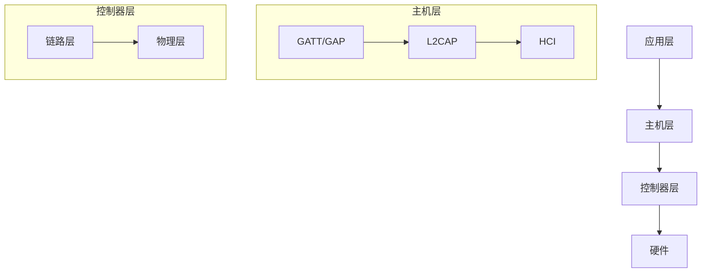

# Zephyr 蓝牙协议栈指南

## 版本信息
- 版本：V1.0
- 更新时间：2025年03月21日 00:00

## 1. 蓝牙架构

### 1.1 协议栈结构



### 1.2 支持的功能

- 低功耗蓝牙 (BLE)
- GATT 服务器/客户端
- 多连接支持
- 安全管理
- 网状网络
- 配对和绑定
- 广播和扫描

## 2. 基本配置

### 2.1 Kconfig配置

```kconfig
# 基本蓝牙支持
CONFIG_BT=y
CONFIG_BT_DEBUG_LOG=y
CONFIG_BT_PERIPHERAL=y
CONFIG_BT_CENTRAL=y

# GATT配置
CONFIG_BT_GATT_DYNAMIC_DB=y
CONFIG_BT_GATT_CLIENT=y

# 安全配置
CONFIG_BT_SMP=y
CONFIG_BT_PRIVACY=y

# 设备名称
CONFIG_BT_DEVICE_NAME="Zephyr BLE Device"
```

## 3. 外围设备开发

### 3.1 基本广播

```c
#include <zephyr/bluetooth/bluetooth.h>
#include <zephyr/bluetooth/hci.h>

void start_advertising(void)
{
    int err;
    
    /* 广播数据 */
    struct bt_data ad[] = {
        BT_DATA_BYTES(BT_DATA_FLAGS,
                      (BT_LE_AD_GENERAL | BT_LE_AD_NO_BREDR)),
        BT_DATA_BYTES(BT_DATA_NAME_COMPLETE,
                      'Z', 'e', 'p', 'h', 'y', 'r')
    };
    
    /* 启动广播 */
    err = bt_le_adv_start(BT_LE_ADV_CONN, ad, ARRAY_SIZE(ad),
                         NULL, 0);
    if (err) {
        printk("Advertising failed to start (err %d)\n", err);
        return;
    }
    
    printk("Advertising started\n");
}

void main(void)
{
    int err;
    
    /* 初始化蓝牙 */
    err = bt_enable(NULL);
    if (err) {
        printk("Bluetooth init failed (err %d)\n", err);
        return;
    }
    
    start_advertising();
}
```

### 3.2 GATT服务实现

```c
#include <zephyr/bluetooth/bluetooth.h>
#include <zephyr/bluetooth/gatt.h>
#include <zephyr/bluetooth/uuid.h>

/* 自定义服务UUID */
#define MY_SERVICE_UUID BT_UUID_DECLARE_16(0xAAAA)
#define MY_CHAR_UUID    BT_UUID_DECLARE_16(0xBBBB)

/* 特征值回调函数 */
ssize_t read_characteristic(struct bt_conn *conn,
                          const struct bt_gatt_attr *attr,
                          void *buf, uint16_t len, uint16_t offset)
{
    const char *value = "Hello GATT";
    return bt_gatt_attr_read(conn, attr, buf, len, offset,
                            value, strlen(value));
}

/* 定义GATT服务 */
BT_GATT_SERVICE_DEFINE(my_service,
    BT_GATT_PRIMARY_SERVICE(MY_SERVICE_UUID),
    BT_GATT_CHARACTERISTIC(MY_CHAR_UUID,
                          BT_GATT_CHRC_READ,
                          BT_GATT_PERM_READ,
                          read_characteristic, NULL, NULL),
);
```

## 4. 中心设备开发

### 4.1 扫描实现

```c
#include <zephyr/bluetooth/bluetooth.h>
#include <zephyr/bluetooth/hci.h>

/* 扫描回调函数 */
static void scan_cb(const bt_addr_le_t *addr, int8_t rssi,
                   uint8_t adv_type, struct net_buf_simple *buf)
{
    char addr_str[BT_ADDR_LE_STR_LEN];
    
    bt_addr_le_to_str(addr, addr_str, sizeof(addr_str));
    printk("Device found: %s (RSSI %d)\n", addr_str, rssi);
}

void start_scan(void)
{
    int err;
    
    /* 配置扫描参数 */
    struct bt_le_scan_param scan_param = {
        .type = BT_LE_SCAN_TYPE_ACTIVE,
        .options = BT_LE_SCAN_OPT_NONE,
        .interval = BT_GAP_SCAN_FAST_INTERVAL,
        .window = BT_GAP_SCAN_FAST_WINDOW,
    };
    
    /* 启动扫描 */
    err = bt_le_scan_start(&scan_param, scan_cb);
    if (err) {
        printk("Scanning failed to start (err %d)\n", err);
        return;
    }
    
    printk("Scanning started\n");
}
```

### 4.2 连接管理

```c
#include <zephyr/bluetooth/bluetooth.h>
#include <zephyr/bluetooth/conn.h>

struct bt_conn *default_conn;

/* 连接回调 */
static void connected_cb(struct bt_conn *conn, uint8_t err)
{
    if (err) {
        printk("Connection failed (err %u)\n", err);
        return;
    }
    
    default_conn = bt_conn_ref(conn);
    printk("Connected\n");
}

/* 断开连接回调 */
static void disconnected_cb(struct bt_conn *conn, uint8_t reason)
{
    printk("Disconnected (reason %u)\n", reason);
    
    if (default_conn) {
        bt_conn_unref(default_conn);
        default_conn = NULL;
    }
}

/* 连接回调结构体 */
static struct bt_conn_cb conn_callbacks = {
    .connected = connected_cb,
    .disconnected = disconnected_cb,
};

void connection_init(void)
{
    bt_conn_cb_register(&conn_callbacks);
}
```

## 5. GATT客户端

### 5.1 服务发现

```c
#include <zephyr/bluetooth/gatt.h>

static uint8_t discover_func(struct bt_conn *conn,
                           const struct bt_gatt_attr *attr,
                           struct bt_gatt_discover_params *params)
{
    if (!attr) {
        printk("Discovery complete\n");
        return BT_GATT_ITER_STOP;
    }
    
    printk("Discovered attribute at handle %u\n", attr->handle);
    
    return BT_GATT_ITER_CONTINUE;
}

void discover_services(struct bt_conn *conn)
{
    static struct bt_gatt_discover_params discover_params;
    
    discover_params.uuid = NULL;
    discover_params.func = discover_func;
    discover_params.start_handle = 0x0001;
    discover_params.end_handle = 0xffff;
    discover_params.type = BT_GATT_DISCOVER_PRIMARY;
    
    int err = bt_gatt_discover(conn, &discover_params);
    if (err) {
        printk("Discover failed(err %d)\n", err);
    }
}
```

### 5.2 特征值操作

```c
#include <zephyr/bluetooth/gatt.h>

/* 读取回调 */
static uint8_t read_func(struct bt_conn *conn, uint8_t err,
                        struct bt_gatt_read_params *params,
                        const void *data, uint16_t length)
{
    if (err) {
        printk("Read failed (err %d)\n", err);
        return BT_GATT_ITER_STOP;
    }
    
    if (data) {
        printk("Read value: %.*s\n", length, (char *)data);
    }
    
    return BT_GATT_ITER_STOP;
}

/* 写入完成回调 */
static void write_func(struct bt_conn *conn, uint8_t err,
                      struct bt_gatt_write_params *params)
{
    if (err) {
        printk("Write failed (err %d)\n", err);
    } else {
        printk("Write successful\n");
    }
}

/* 读取特征值 */
void read_characteristic(struct bt_conn *conn, uint16_t handle)
{
    static struct bt_gatt_read_params read_params;
    
    read_params.func = read_func;
    read_params.handle_count = 1;
    read_params.single.handle = handle;
    read_params.single.offset = 0;
    
    int err = bt_gatt_read(conn, &read_params);
    if (err) {
        printk("Read failed (err %d)\n", err);
    }
}

/* 写入特征值 */
void write_characteristic(struct bt_conn *conn, uint16_t handle,
                         const uint8_t *data, uint16_t length)
{
    static struct bt_gatt_write_params write_params;
    
    write_params.func = write_func;
    write_params.handle = handle;
    write_params.offset = 0;
    write_params.data = data;
    write_params.length = length;
    
    int err = bt_gatt_write(conn, &write_params);
    if (err) {
        printk("Write failed (err %d)\n", err);
    }
}
```

## 6. 安全管理

### 6.1 配对和绑定

```c
#include <zephyr/bluetooth/conn.h>

/* 配对状态回调 */
static void pairing_complete(struct bt_conn *conn, bool bonded)
{
    printk("Pairing %s\n", bonded ? "bonded" : "complete");
}

/* 配对失败回调 */
static void pairing_failed(struct bt_conn *conn,
                          enum bt_security_err reason)
{
    printk("Pairing failed (reason %d)\n", reason);
}

/* 配对回调结构体 */
static struct bt_conn_auth_cb auth_callbacks = {
    .pairing_complete = pairing_complete,
    .pairing_failed = pairing_failed,
};

void security_init(void)
{
    bt_conn_auth_cb_register(&auth_callbacks);
}

/* 设置安全等级 */
void set_security(struct bt_conn *conn)
{
    int err = bt_conn_set_security(conn, BT_SECURITY_L2);
    if (err) {
        printk("Failed to set security (err %d)\n", err);
    }
}
```

### 6.2 加密数据传输

```c
#include <zephyr/bluetooth/crypto.h>

void encrypt_data(void)
{
    uint8_t key[16] = {0};
    uint8_t plaintext[] = "Secret Message";
    uint8_t encrypted[sizeof(plaintext)];
    
    /* 生成随机密钥 */
    bt_rand(key, sizeof(key));
    
    /* 加密数据 */
    int err = bt_encrypt_le(key, plaintext, encrypted);
    if (err) {
        printk("Encryption failed (err %d)\n", err);
        return;
    }
    
    printk("Data encrypted successfully\n");
}
```

## 7. 蓝牙网状网络

### 7.1 网状网络节点

```c
#include <zephyr/bluetooth/mesh.h>

/* 模型操作码 */
#define OP_ONOFF_GET    BT_MESH_MODEL_OP_2(0x82, 0x01)
#define OP_ONOFF_SET    BT_MESH_MODEL_OP_2(0x82, 0x02)
#define OP_ONOFF_STATUS BT_MESH_MODEL_OP_2(0x82, 0x03)

/* 模型回调函数 */
static void onoff_get(struct bt_mesh_model *model,
                     struct bt_mesh_msg_ctx *ctx,
                     struct net_buf_simple *buf)
{
    NET_BUF_SIMPLE_DEFINE(msg, 2 + 1 + 4);
    
    bt_mesh_model_msg_init(&msg, OP_ONOFF_STATUS);
    net_buf_simple_add_u8(&msg, 0x01);
    
    bt_mesh_model_send(model, ctx, &msg, NULL, NULL);
}

/* 模型操作结构体 */
static const struct bt_mesh_model_op onoff_op[] = {
    { OP_ONOFF_GET, 0, onoff_get },
    BT_MESH_MODEL_OP_END,
};

/* 初始化网状网络 */
void mesh_init(void)
{
    int err;
    
    /* 配置和初始化网状网络 */
    static struct bt_mesh_model_pub pub = {
        .msg = NET_BUF_SIMPLE(2 + 1),
    };
    
    static struct bt_mesh_model models[] = {
        BT_MESH_MODEL_CFG_SRV,
        BT_MESH_MODEL(BT_MESH_MODEL_ID_GEN_ONOFF_SRV, onoff_op,
                      &pub, NULL),
    };
    
    static struct bt_mesh_elem elements[] = {
        BT_MESH_ELEM(0, models, BT_MESH_MODEL_NONE),
    };
    
    static const struct bt_mesh_comp comp = {
        .cid = 0xFFFF,
        .elem = elements,
        .elem_count = ARRAY_SIZE(elements),
    };
    
    err = bt_mesh_init(&comp);
    if (err) {
        printk("Mesh initialization failed (err %d)\n", err);
    }
}
```