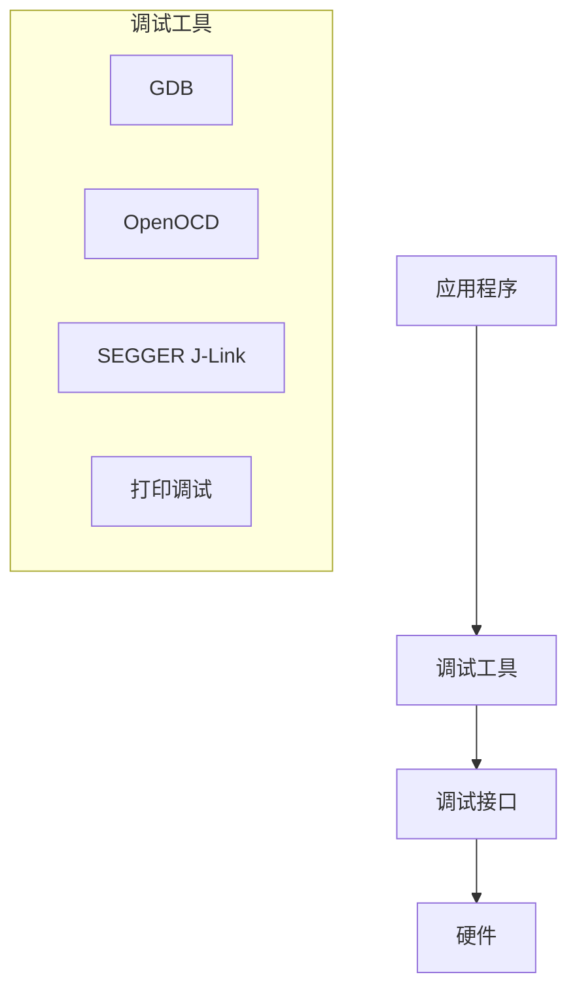

## 版本信息
- 版本：V1.0
- 更新时间：2025年03月21日 01:45
# Zephyr 调试工具指南

## 1. 调试工具概述

### 1.1 调试架构



### 1.2 支持的调试方式

- GDB/OpenOCD调试
- SEGGER J-Link调试
- printf/printk调试
- 系统查看器
- 内存调试
- 性能分析

## 2. GDB调试

### 2.1 配置

```kconfig
# 调试支持
CONFIG_DEBUG=y

# GDB调试支持
CONFIG_GDB_SERVER=y
CONFIG_DEBUG_THREAD_INFO=y

# 优化级别
CONFIG_DEBUG_OPTIMIZATIONS=y
```

### 2.2 使用GDB

```bash
# 启动OpenOCD
openocd -f board/stm32f4discovery.cfg

# 在另一个终端启动GDB
arm-zephyr-eabi-gdb build/zephyr/zephyr.elf

# GDB命令
(gdb) target remote localhost:3333
(gdb) monitor reset halt
(gdb) break main
(gdb) continue
```

### 2.3 GDB脚本示例

```gdb
# .gdbinit
set print pretty on
set print array on
set print array-indexes on

define reload
    monitor reset halt
    load
    monitor reset init
end

define restart
    monitor reset halt
    continue
end
```

## 3. 日志系统

### 3.1 配置日志

```kconfig
# 日志系统配置
CONFIG_LOG=y
CONFIG_LOG_DEFAULT_LEVEL=3
CONFIG_LOG_BACKEND_UART=y
CONFIG_LOG_BACKEND_RTT=y
```

### 3.2 使用日志

```c
#include <zephyr/logging/log.h>
LOG_MODULE_REGISTER(my_module, LOG_LEVEL_DBG);

void debug_example(void)
{
    /* 不同级别的日志 */
    LOG_DBG("Debug message");
    LOG_INF("Info message");
    LOG_WRN("Warning message");
    LOG_ERR("Error message");
    
    /* 带参数的日志 */
    int value = 42;
    LOG_INF("Value is %d", value);
    
    /* 十六进制dump */
    uint8_t data[] = {0x01, 0x02, 0x03, 0x04};
    LOG_HEXDUMP_DBG(data, sizeof(data), "Data dump:");
}
```

## 4. 内存调试

### 4.1 内存检测工具

```c
#include <zephyr/kernel.h>
#include <zephyr/debug/heap.h>

void memory_debug(void)
{
    /* 获取堆使用情况 */
    struct k_heap_stats stats;
    k_heap_stats_get(&stats);
    
    printk("Total bytes: %zu\n", stats.total_bytes);
    printk("Used bytes: %zu\n", stats.used_bytes);
    printk("Free bytes: %zu\n", stats.free_bytes);
    
    /* 内存泄漏检测 */
    void *ptr = k_malloc(100);
    // k_free(ptr); // 注释掉以模拟内存泄漏
}
```

### 4.2 堆栈分析

```c
#include <zephyr/debug/stack.h>

void stack_analysis(void)
{
    /* 获取当前线程堆栈使用情况 */
    k_thread_stack_space_get(k_current_get(), &stack_space);
    printk("Stack space: %zu\n", stack_space);
    
    /* 打印堆栈跟踪 */
    k_stack_dump(k_current_get());
}
```

## 5. 性能分析

### 5.1 时间测量

```c
#include <zephyr/kernel.h>
#include <zephyr/timing/timing.h>

void performance_measurement(void)
{
    uint32_t start_time, end_time;
    uint32_t cycles, ns;
    
    /* 开始计时 */
    timing_start();
    start_time = timing_counter_get();
    
    /* 执行要测量的代码 */
    for (int i = 0; i < 1000; i++) {
        /* 测试代码 */
    }
    
    /* 结束计时 */
    end_time = timing_counter_get();
    cycles = timing_cycles_get(&start_time, &end_time);
    ns = timing_cycles_to_ns(cycles);
    
    printk("Execution time: %u cycles (%u ns)\n",
           cycles, ns);
}
```

### 5.2 CPU负载监控

```c
#include <zephyr/kernel.h>

void cpu_load_monitor(void)
{
    /* 获取线程运行时统计 */
    k_thread_runtime_stats_t stats;
    k_thread_runtime_stats_all_get(&stats);
    
    /* 计算CPU使用率 */
    uint64_t total = stats.total_cycles;
    uint64_t idle = stats.idle_cycles;
    uint32_t usage = (total - idle) * 100 / total;
    
    printk("CPU Usage: %u%%\n", usage);
}
```

## 6. SEGGER SystemView

### 6.1 配置SystemView

```kconfig
# SystemView配置
CONFIG_SEGGER_SYSTEMVIEW=y
CONFIG_SEGGER_RTT=y
CONFIG_TRACING=y
```

### 6.2 使用SystemView

```c
#include <SEGGER_SYSVIEW.h>

void systemview_example(void)
{
    /* 初始化SystemView */
    SEGGER_SYSVIEW_Init();
    
    /* 记录事件 */
    SEGGER_SYSVIEW_PrintfTarget("Event occurred");
    
    /* 开始任务 */
    SEGGER_SYSVIEW_OnTaskStartExec(task_id);
    
    /* 执行任务 */
    
    /* 结束任务 */
    SEGGER_SYSVIEW_OnTaskStopExec();
}
```

## 7. 断言和错误处理

### 7.1 断言使用

```c
#include <zephyr/sys/__assert.h>

void assert_example(void *data, size_t len)
{
    /* 参数检查 */
    __ASSERT(data != NULL, "data pointer is NULL");
    __ASSERT(len > 0, "length must be positive");
    
    /* 状态检查 */
    __ASSERT(is_initialized(),
             "System not initialized");
    
    /* 范围检查 */
    __ASSERT(len <= MAX_LENGTH,
             "length exceeds maximum");
}
```

### 7.2 错误追踪

```c
#include <zephyr/kernel.h>

void error_tracking(void)
{
    /* 错误代码 */
    int err = -EIO;
    
    /* 错误处理 */
    if (err < 0) {
        printk("Error occurred: %d\n", err);
        k_oops();  // 触发系统错误
    }
}
```

## 8. 调试实践

### 8.1 远程调试配置

```json
// .vscode/launch.json
{
    "version": "0.2.0",
    "configurations": [
        {
            "name": "Zephyr Debug",
            "type": "cortex-debug",
            "request": "launch",
            "servertype": "openocd",
            "cwd": "${workspaceFolder}",
            "executable": "build/zephyr/zephyr.elf",
            "device": "STM32F407VG",
            "configFiles": [
                "board/st_nucleo_f4.cfg"
            ]
        }
    ]
}
```

### 8.2 调试会话示例

```c
#include <zephyr/kernel.h>
#include <zephyr/logging/log.h>

LOG_MODULE_REGISTER(debug_demo, LOG_LEVEL_DBG);

void debug_session_example(void)
{
    int counter = 0;
    
    LOG_INF("Starting debug session");
    
    while (counter < 5) {
        /* 设置断点的好位置 */
        counter++;
        LOG_DBG("Counter value: %d", counter);
        
        if (counter == 3) {
            LOG_WRN("Counter reached 3!");
        }
        
        k_sleep(K_MSEC(1000));
    }
    
    LOG_INF("Debug session completed");
}
```

### 8.3 常见问题调试

```c
void debug_common_issues(void)
{
    /* 1. 内存问题 */
    void *ptr = k_malloc(100);
    if (ptr == NULL) {
        LOG_ERR("Memory allocation failed");
        return;
    }
    
    /* 2. 定时问题 */
    uint32_t start = k_uptime_get_32();
    k_sleep(K_MSEC(100));
    uint32_t duration = k_uptime_get_32() - start;
    LOG_INF("Sleep duration: %u ms", duration);
    
    /* 3. 中断问题 */
    unsigned int key = irq_lock();
    /* 临界区代码 */
    irq_unlock(key);
    
    /* 4. 线程问题 */
    k_thread_state_str(k_current_get(), key, 100);
    LOG_INF("Thread state: %s", key);
}
```