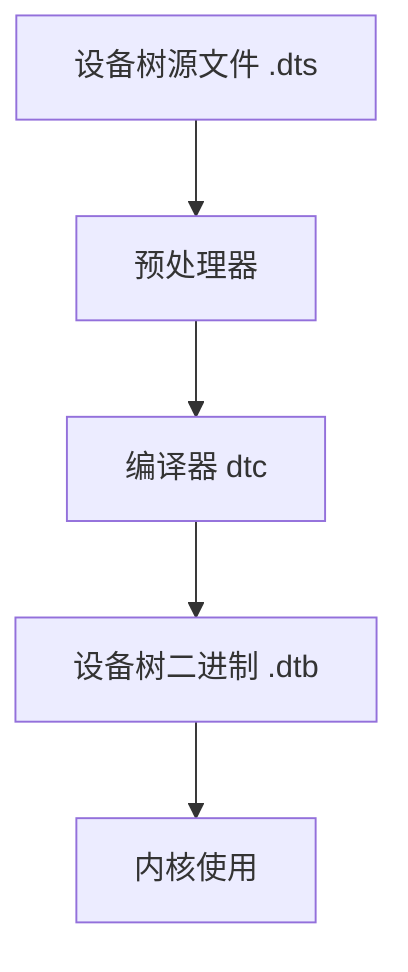

# Zephyr 设备树指南

## 1. 设备树基础

### 1.1 设备树概述



### 1.2 基本语法

```dts
/* 基本节点结构 */
/ {
    node-name@unit-address {
        compatible = "vendor,device";
        reg = <address size>;
        status = "okay";
        
        child-node {
            property1 = "value";
            property2 = <numeric-value>;
        };
    };
};
```

## 2. 常用节点类型

### 2.1 CPU节点

```dts
cpus {
    #address-cells = <1>;
    #size-cells = <0>;
    
    cpu@0 {
        device_type = "cpu";
        compatible = "arm,cortex-m4f";
        reg = <0>;
        clock-frequency = <80000000>;
    };
};
```

### 2.2 内存节点

```dts
memory@20000000 {
    device_type = "memory";
    reg = <0x20000000 0x20000>;
};
```

### 2.3 GPIO控制器

```dts
gpio0: gpio@40000000 {
    compatible = "nordic,nrf-gpio";
    reg = <0x40000000 0x1000>;
    #gpio-cells = <2>;
    status = "okay";
};
```

### 2.4 串口设备

```dts
uart0: uart@40002000 {
    compatible = "nordic,nrf-uarte";
    reg = <0x40002000 0x1000>;
    interrupts = <2 1>;
    status = "okay";
    current-speed = <115200>;
};
```

## 3. 属性定义

### 3.1 常用属性

```dts
my-device {
    /* 基本属性 */
    compatible = "vendor,device";
    reg = <0x40000000 0x1000>;
    status = "okay";
    
    /* 中断属性 */
    interrupts = <2 1>;
    interrupt-parent = <&intc>;
    
    /* 时钟属性 */
    clocks = <&clk 1>;
    clock-frequency = <100000000>;
    
    /* GPIO属性 */
    gpios = <&gpio0 13 GPIO_ACTIVE_HIGH>;
    
    /* 自定义属性 */
    my-property = "custom value";
    my-numbers = <1 2 3>;
};
```

### 3.2 标签和引用

```dts
/* 定义标签 */
uart0: uart@40002000 {
    /* 节点内容 */
};

/* 引用标签 */
my-device {
    my-uart = <&uart0>;
};
```

## 4. 设备树覆盖

### 4.1 覆盖文件

```dts
/* board.overlay */
/ {
    chosen {
        zephyr,console = &uart0;
    };
    
    /* 修改现有节点 */
    &uart0 {
        status = "okay";
        current-speed = <230400>;
    };
    
    /* 添加新节点 */
    new-device {
        compatible = "vendor,new-device";
        status = "okay";
    };
};
```

### 4.2 条件编译

```dts
/* 使用预处理器指令 */
#ifdef CONFIG_FEATURE
    feature-node {
        status = "okay";
    };
#else
    feature-node {
        status = "disabled";
    };
#endif
```

## 5. 设备树绑定

### 5.1 绑定文件

```yaml
# dts/bindings/vendor,device.yaml
description: My Device

compatible: "vendor,device"

properties:
    reg:
        required: true
        type: array
        description: Register address and size
        
    interrupts:
        required: true
        type: array
        description: Interrupt lines
        
    my-property:
        required: false
        type: string
        description: Custom property
```

### 5.2 绑定示例

```dts
/* 使用绑定的设备 */
my-device {
    compatible = "vendor,device";
    reg = <0x40000000 0x1000>;
    interrupts = <2 1>;
    my-property = "value";
};
```

## 6. 代码中使用设备树

### 6.1 获取设备

```c
#include <zephyr/device.h>
#include <zephyr/devicetree.h>

/* 通过节点标识符获取设备 */
#define MY_DEVICE DT_NODELABEL(my_device)

void device_example(void)
{
    const struct device *dev;
    
    dev = DEVICE_DT_GET(MY_DEVICE);
    if (!device_is_ready(dev)) {
        return;
    }
    
    /* 使用设备 */
}
```

### 6.2 访问属性

```c
#include <zephyr/devicetree.h>

/* 获取属性值 */
#define MY_DEVICE DT_NODELABEL(my_device)

/* 获取reg属性 */
#define DEV_BASE_ADDR DT_REG_ADDR(MY_DEVICE)
#define DEV_SIZE DT_REG_SIZE(MY_DEVICE)

/* 获取其他属性 */
#define DEV_STATUS DT_PROP(MY_DEVICE, status)
#define DEV_SPEED DT_PROP(MY_DEVICE, current-speed)

/* 检查属性是否存在 */
#if DT_NODE_HAS_PROP(MY_DEVICE, my_property)
    #define MY_PROP DT_PROP(MY_DEVICE, my_property)
#endif
```

## 7. 实际应用示例

### 7.1 LED控制器

```dts
/* 定义LED节点 */
leds {
    compatible = "gpio-leds";
    led0: led_0 {
        gpios = <&gpio0 13 GPIO_ACTIVE_LOW>;
        label = "Green LED 0";
    };
    led1: led_1 {
        gpios = <&gpio0 14 GPIO_ACTIVE_LOW>;
        label = "Red LED 1";
    };
};
```

```c
/* 在代码中使用LED */
#include <zephyr/devicetree.h>
#include <zephyr/drivers/gpio.h>

#define LED0_NODE DT_ALIAS(led0)
static const struct gpio_dt_spec led0 = GPIO_DT_SPEC_GET(LED0_NODE, gpios);

void led_control(void)
{
    if (!device_is_ready(led0.port)) {
        return;
    }
    
    gpio_pin_configure_dt(&led0, GPIO_OUTPUT_ACTIVE);
    gpio_pin_toggle_dt(&led0);
}
```

### 7.2 传感器配置

```dts
/* 定义I2C传感器 */
&i2c0 {
    status = "okay";
    clock-frequency = <I2C_BITRATE_STANDARD>;
    
    sensor0: sensor@48 {
        compatible = "vendor,temperature-sensor";
        reg = <0x48>;
        int-gpios = <&gpio0 24 GPIO_ACTIVE_LOW>;
        status = "okay";
    };
};
```

```c
/* 在代码中使用传感器 */
#include <zephyr/devicetree.h>
#include <zephyr/drivers/sensor.h>

#define SENSOR_NODE DT_NODELABEL(sensor0)

void sensor_example(void)
{
    const struct device *dev;
    struct sensor_value temp;
    
    dev = DEVICE_DT_GET(SENSOR_NODE);
    if (!device_is_ready(dev)) {
        return;
    }
    
    sensor_sample_fetch(dev);
    sensor_channel_get(dev, SENSOR_CHAN_AMBIENT_TEMP, &temp);
}
```

### 7.3 串口配置

```dts
/* 配置串口 */
&uart0 {
    status = "okay";
    current-speed = <115200>;
    pinctrl-0 = <&uart0_default>;
    pinctrl-names = "default";
};
```

```c
/* 在代码中使用串口 */
#include <zephyr/devicetree.h>
#include <zephyr/drivers/uart.h>

#define UART_NODE DT_NODELABEL(uart0)

void uart_example(void)
{
    const struct device *dev;
    
    dev = DEVICE_DT_GET(UART_NODE);
    if (!device_is_ready(dev)) {
        return;
    }
    
    /* 使用串口 */
    uint8_t data[] = "Hello\n";
    for (int i = 0; i < sizeof(data); i++) {
        uart_poll_out(dev, data[i]);
    }
}
```