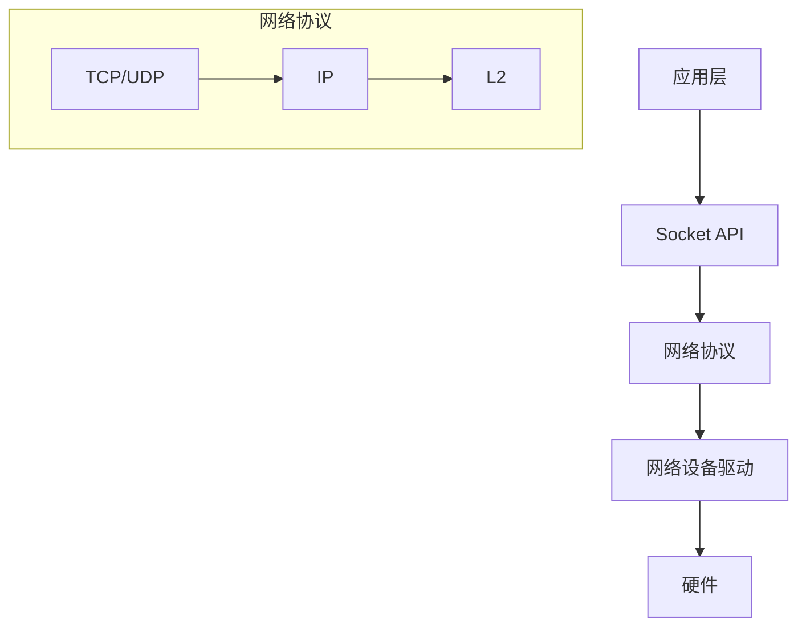

# Zephyr 网络协议栈指南

## 1. 网络架构

### 1.1 协议栈结构



### 1.2 支持的协议

- IPv4/IPv6
- TCP/UDP
- MQTT
- CoAP
- HTTP
- WebSocket
- DTLS
- 6LoWPAN
- Bluetooth

## 2. 网络配置

### 2.1 基本配置

```kconfig
# 网络功能配置
CONFIG_NETWORKING=y
CONFIG_NET_IPV4=y
CONFIG_NET_IPV6=y
CONFIG_NET_TCP=y
CONFIG_NET_UDP=y

# 网络缓冲区配置
CONFIG_NET_BUF_RX_COUNT=16
CONFIG_NET_BUF_TX_COUNT=16
CONFIG_NET_BUF_DATA_SIZE=128

# 网络接口配置
CONFIG_NET_IF_UNICAST_IPV4_ADDR_COUNT=1
CONFIG_NET_IF_MCAST_IPV4_ADDR_COUNT=1
CONFIG_NET_IF_UNICAST_IPV6_ADDR_COUNT=1
CONFIG_NET_IF_MCAST_IPV6_ADDR_COUNT=1
```

### 2.2 网络接口配置

```c
#include <zephyr/net/net_if.h>

void network_setup(void)
{
    struct net_if *iface;
    struct in_addr addr;
    
    /* 获取默认网络接口 */
    iface = net_if_get_default();
    if (!iface) {
        return;
    }
    
    /* 配置IPv4地址 */
    net_addr_pton(AF_INET, "192.168.1.100", &addr);
    net_if_ipv4_addr_add(iface, &addr, NET_ADDR_MANUAL, 0);
}
```

## 3. Socket 编程

### 3.1 TCP服务器

```c
#include <zephyr/net/socket.h>

#define PORT 8080
#define BACKLOG 5

void tcp_server(void)
{
    int serv_sock, client_sock;
    struct sockaddr_in server_addr, client_addr;
    socklen_t client_addr_len = sizeof(client_addr);
    char rx_buf[128];
    
    /* 创建socket */
    serv_sock = socket(AF_INET, SOCK_STREAM, IPPROTO_TCP);
    if (serv_sock < 0) {
        return;
    }
    
    /* 配置服务器地址 */
    server_addr.sin_family = AF_INET;
    server_addr.sin_addr.s_addr = INADDR_ANY;
    server_addr.sin_port = htons(PORT);
    
    /* 绑定地址 */
    if (bind(serv_sock, (struct sockaddr *)&server_addr,
             sizeof(server_addr)) < 0) {
        close(serv_sock);
        return;
    }
    
    /* 监听连接 */
    if (listen(serv_sock, BACKLOG) < 0) {
        close(serv_sock);
        return;
    }
    
    while (1) {
        /* 接受连接 */
        client_sock = accept(serv_sock,
                           (struct sockaddr *)&client_addr,
                           &client_addr_len);
        if (client_sock < 0) {
            continue;
        }
        
        /* 处理数据 */
        while (1) {
            int received = recv(client_sock, rx_buf,
                              sizeof(rx_buf), 0);
            if (received <= 0) {
                break;
            }
            send(client_sock, rx_buf, received, 0);
        }
        
        close(client_sock);
    }
}
```

### 3.2 UDP通信

```c
#include <zephyr/net/socket.h>

void udp_example(void)
{
    int sock;
    struct sockaddr_in server_addr, client_addr;
    char rx_buf[128];
    
    /* 创建UDP socket */
    sock = socket(AF_INET, SOCK_DGRAM, IPPROTO_UDP);
    if (sock < 0) {
        return;
    }
    
    /* 配置地址 */
    server_addr.sin_family = AF_INET;
    server_addr.sin_addr.s_addr = INADDR_ANY;
    server_addr.sin_port = htons(8080);
    
    /* 绑定地址 */
    if (bind(sock, (struct sockaddr *)&server_addr,
             sizeof(server_addr)) < 0) {
        close(sock);
        return;
    }
    
    while (1) {
        socklen_t client_addr_len = sizeof(client_addr);
        
        /* 接收数据 */
        int received = recvfrom(sock, rx_buf, sizeof(rx_buf), 0,
                              (struct sockaddr *)&client_addr,
                              &client_addr_len);
        if (received < 0) {
            continue;
        }
        
        /* 发送响应 */
        sendto(sock, rx_buf, received, 0,
               (struct sockaddr *)&client_addr,
               client_addr_len);
    }
}
```

## 4. HTTP客户端

### 4.1 HTTP GET请求

```c
#include <zephyr/net/http/client.h>

#define HTTP_PORT 80
#define RECV_BUFFER_SIZE 512

void http_get_example(void)
{
    struct http_client_req req;
    struct http_client_resp rsp;
    uint8_t recv_buf[RECV_BUFFER_SIZE];
    int ret;
    
    /* 配置HTTP请求 */
    memset(&req, 0, sizeof(req));
    memset(&rsp, 0, sizeof(rsp));
    
    req.method = HTTP_GET;
    req.url = "http://example.com/api/data";
    req.host = "example.com";
    req.protocol = "HTTP/1.1";
    req.response = recv_buf;
    req.response_size = sizeof(recv_buf);
    
    /* 发送请求 */
    ret = http_client_req(&req, &rsp);
    if (ret < 0) {
        return;
    }
    
    /* 处理响应 */
    if (rsp.http_status_code == 200) {
        printk("Response: %s\n", rsp.body_start);
    }
}
```

## 5. MQTT客户端

### 5.1 MQTT连接和发布

```c
#include <zephyr/net/mqtt.h>

/* MQTT配置 */
#define MQTT_CLIENTID "zephyr_client"
#define MQTT_BROKER_ADDR "broker.example.com"
#define MQTT_BROKER_PORT 1883

/* MQTT回调函数 */
void mqtt_evt_handler(struct mqtt_client *client,
                     const struct mqtt_evt *evt)
{
    switch (evt->type) {
    case MQTT_EVT_CONNACK:
        if (evt->result == 0) {
            printk("MQTT connected\n");
        }
        break;
        
    case MQTT_EVT_PUBLISH:
        printk("MQTT message received\n");
        break;
        
    default:
        break;
    }
}

void mqtt_example(void)
{
    struct mqtt_client client;
    struct sockaddr_in broker;
    
    /* 配置MQTT客户端 */
    mqtt_client_init(&client);
    
    broker.sin_family = AF_INET;
    broker.sin_port = htons(MQTT_BROKER_PORT);
    net_addr_pton(AF_INET, MQTT_BROKER_ADDR,
                  &broker.sin_addr);
    
    client.broker = &broker;
    client.evt_cb = mqtt_evt_handler;
    client.client_id.utf8 = MQTT_CLIENTID;
    client.client_id.size = strlen(MQTT_CLIENTID);
    
    /* 连接到MQTT服务器 */
    mqtt_connect(&client);
    
    /* 发布消息 */
    struct mqtt_publish_param param;
    param.message.topic.topic.utf8 = "test/topic";
    param.message.topic.topic.size = strlen("test/topic");
    param.message.payload.data = "Hello MQTT";
    param.message.payload.len = strlen("Hello MQTT");
    param.message_id = 1;
    param.dup_flag = 0;
    param.retain_flag = 0;
    
    mqtt_publish(&client, &param);
}
```

## 6. 网络诊断工具

### 6.1 Ping

```c
#include <zephyr/net/ping.h>

void ping_example(void)
{
    struct sockaddr_in addr;
    int ret;
    
    /* 配置目标地址 */
    addr.sin_family = AF_INET;
    net_addr_pton(AF_INET, "8.8.8.8", &addr.sin_addr);
    
    /* 发送ping */
    ret = net_ping((struct sockaddr *)&addr,
                   sizeof(addr), 1000);
    if (ret == 0) {
        printk("Ping successful\n");
    }
}
```

### 6.2 网络状态监控

```c
#include <zephyr/net/net_stats.h>

void print_network_stats(void)
{
    struct net_stats stats;
    net_mgmt(NET_REQUEST_STATS_GET_ALL, NULL, &stats,
             sizeof(stats));
    
    printk("IPv4 packets received: %d\n",
           stats.ipv4.recv);
    printk("IPv4 packets sent: %d\n",
           stats.ipv4.sent);
    printk("TCP bytes received: %d\n",
           stats.tcp.bytes.received);
    printk("TCP bytes sent: %d\n",
           stats.tcp.bytes.sent);
}
```

## 7. 网络安全

### 7.1 TLS配置

```c
#include <zephyr/net/tls_credentials.h>

void tls_setup(void)
{
    int ret;
    
    /* 加载证书 */
    ret = tls_credential_add(CA_CERTIFICATE_TAG,
                            TLS_CREDENTIAL_CA_CERTIFICATE,
                            ca_certificate,
                            sizeof(ca_certificate));
    if (ret < 0) {
        printk("Failed to add CA certificate\n");
        return;
    }
    
    /* 配置TLS */
    struct tls_credential_t tls_creds = {
        .type = TLS_CREDENTIAL_NONE,
        .tag = CA_CERTIFICATE_TAG,
    };
    
    /* 使用TLS创建安全socket */
    int sock = socket(AF_INET, SOCK_STREAM, IPPROTO_TLS_1_2);
    if (sock < 0) {
        return;
    }
    
    /* 设置TLS选项 */
    setsockopt(sock, SOL_TLS, TLS_SEC_TAG_LIST,
               &tls_creds, sizeof(tls_creds));
}
```

### 7.2 DTLS示例

```c
#include <zephyr/net/socket.h>
#include <zephyr/net/tls_credentials.h>

void dtls_example(void)
{
    int sock;
    struct sockaddr_in addr;
    
    /* 创建DTLS socket */
    sock = socket(AF_INET, SOCK_DGRAM, IPPROTO_DTLS_1_2);
    if (sock < 0) {
        return;
    }
    
    /* 配置DTLS */
    sec_tag_t sec_tag_list[] = {
        CA_CERTIFICATE_TAG,
    };
    
    setsockopt(sock, SOL_TLS, TLS_SEC_TAG_LIST,
               sec_tag_list, sizeof(sec_tag_list));
               
    /* 配置地址并连接 */
    addr.sin_family = AF_INET;
    addr.sin_port = htons(5684);
    net_addr_pton(AF_INET, "192.168.1.100", &addr.sin_addr);
    
    connect(sock, (struct sockaddr *)&addr, sizeof(addr));
}
```