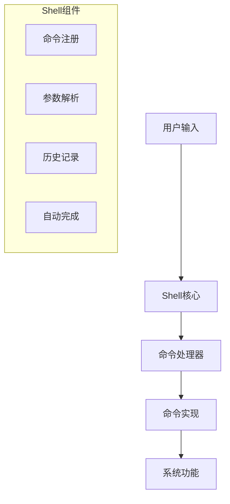

# Zephyr Shell 命令系统指南

## 1. Shell系统架构

### 1.1 整体架构



### 1.2 基本配置

```kconfig
# Shell基本支持
CONFIG_SHELL=y

# 历史记录支持
CONFIG_SHELL_HISTORY=y

# 通配符支持
CONFIG_SHELL_WILDCARD=y

# 命令日志
CONFIG_SHELL_LOGGING=y

# 彩色输出
CONFIG_SHELL_VT100_COLORS=y
```

## 2. 命令实现

### 2.1 基本命令

```c
#include <zephyr/shell/shell.h>

/* 简单命令 */
static int cmd_hello(const struct shell *shell,
                    size_t argc, char **argv)
{
    shell_print(shell, "Hello World!");
    return 0;
}

/* 注册命令 */
SHELL_CMD_REGISTER(hello, NULL,
                  "Print Hello World",
                  cmd_hello);
```

### 2.2 子命令

```c
#include <zephyr/shell/shell.h>

/* 子命令处理函数 */
static int cmd_demo_sub1(const struct shell *shell,
                        size_t argc, char **argv)
{
    shell_print(shell, "Subcommand 1");
    return 0;
}

static int cmd_demo_sub2(const struct shell *shell,
                        size_t argc, char **argv)
{
    shell_print(shell, "Subcommand 2");
    return 0;
}

/* 子命令结构 */
SHELL_STATIC_SUBCMD_SET_CREATE(sub_demo,
    SHELL_CMD(sub1, NULL, "Subcommand 1", cmd_demo_sub1),
    SHELL_CMD(sub2, NULL, "Subcommand 2", cmd_demo_sub2),
    SHELL_SUBCMD_SET_END
);

/* 注册主命令 */
SHELL_CMD_REGISTER(demo, &sub_demo,
                  "Demo commands", NULL);
```

## 3. 参数处理

### 3.1 参数解析

```c
#include <zephyr/shell/shell.h>

/* 带参数的命令 */
static int cmd_params(const struct shell *shell,
                     size_t argc, char **argv)
{
    if (argc < 2) {
        shell_error(shell, "Missing parameters!");
        return -EINVAL;
    }
    
    shell_print(shell, "Parameter 1: %s", argv[1]);
    
    if (argc > 2) {
        shell_print(shell, "Parameter 2: %s", argv[2]);
    }
    
    return 0;
}

/* 注册命令 */
SHELL_CMD_REGISTER(params, NULL,
                  "Command with parameters",
                  cmd_params);
```

### 3.2 参数验证

```c
#include <zephyr/shell/shell.h>
#include <stdlib.h>

static int cmd_number(const struct shell *shell,
                     size_t argc, char **argv)
{
    long number;
    char *endptr;
    
    if (argc != 2) {
        shell_error(shell, "Exactly one parameter required!");
        return -EINVAL;
    }
    
    /* 转换并验证数字参数 */
    number = strtol(argv[1], &endptr, 10);
    if (*endptr != '\0') {
        shell_error(shell, "Invalid number format!");
        return -EINVAL;
    }
    
    shell_print(shell, "Number: %ld", number);
    return 0;
}
```

## 4. 输出格式化

### 4.1 基本输出

```c
#include <zephyr/shell/shell.h>

void shell_output_example(const struct shell *shell)
{
    /* 普通输出 */
    shell_print(shell, "Normal message");
    
    /* 警告输出 */
    shell_warn(shell, "Warning message");
    
    /* 错误输出 */
    shell_error(shell, "Error message");
    
    /* 格式化输出 */
    shell_print(shell, "Value: %d", 42);
    
    /* 多行输出 */
    shell_print(shell, "Line 1\n"
                      "Line 2\n"
                      "Line 3");
}
```

### 4.2 表格输出

```c
#include <zephyr/shell/shell.h>

void print_table(const struct shell *shell)
{
    shell_print(shell, "| %-10s | %-8s | %-8s |",
                "Name", "Value", "Unit");
    shell_print(shell, "|------------|----------|----------|");
    shell_print(shell, "| %-10s | %8d | %-8s |",
                "Temperature", 25, "°C");
    shell_print(shell, "| %-10s | %8d | %-8s |",
                "Pressure", 1013, "hPa");
}
```

## 5. 动态命令

### 5.1 运行时注册

```c
#include <zephyr/shell/shell.h>

/* 动态命令结构 */
static struct shell_static_entry dynamic_cmd = {
    .syntax = "dynamic",
    .help = "Dynamic command",
    .handler = NULL
};

/* 注册动态命令 */
void register_dynamic_command(void)
{
    dynamic_cmd.handler = cmd_handler;
    shell_cmd_register(&dynamic_cmd);
}

/* 注销动态命令 */
void unregister_dynamic_command(void)
{
    shell_cmd_unregister(&dynamic_cmd);
}
```

### 5.2 动态子命令

```c
#include <zephyr/shell/shell.h>

/* 动态子命令数组 */
static struct shell_static_entry *dynamic_sub_commands[10];
static size_t dynamic_cmd_count = 0;

/* 添加动态子命令 */
void add_dynamic_subcommand(const char *name,
                           shell_cmd_handler_t handler)
{
    if (dynamic_cmd_count >= 10) {
        return;
    }
    
    struct shell_static_entry *entry =
        k_malloc(sizeof(struct shell_static_entry));
        
    entry->syntax = name;
    entry->handler = handler;
    entry->help = "Dynamic subcommand";
    entry->subcmd = NULL;
    
    dynamic_sub_commands[dynamic_cmd_count++] = entry;
}
```

## 6. 自定义Shell后端

### 6.1 基本实现

```c
#include <zephyr/shell/shell.h>

/* Shell传输接口 */
static int custom_transport_init(const struct shell_transport *transport)
{
    /* 初始化自定义传输 */
    return 0;
}

static int custom_transport_write(const struct shell_transport *transport,
                                const void *data, size_t length)
{
    /* 实现写数据 */
    return length;
}

static int custom_transport_read(const struct shell_transport *transport,
                               void *data, size_t length, size_t *cnt)
{
    /* 实现读数据 */
    return 0;
}

/* 传输接口结构 */
static struct shell_transport_api custom_transport_api = {
    .init = custom_transport_init,
    .write = custom_transport_write,
    .read = custom_transport_read
};

/* Shell传输实例 */
static struct shell_transport custom_transport = {
    .api = &custom_transport_api,
};

/* Shell实例 */
static struct shell_custom {
    struct shell shell;
    struct shell_transport transport;
} shell_custom_instance = {
    .transport = custom_transport
};
```

### 6.2 注册自定义Shell

```c
#include <zephyr/shell/shell.h>

void init_custom_shell(void)
{
    const struct shell_backend_config_flags cfg_flags = {
        .insert_mode = 0,
        .echo = 1,
        .obscure = 0,
        .mode_echo = 0,
    };
    
    shell_init(&shell_custom_instance.shell,
               &custom_transport,
               &cfg_flags,
               true,
               true,
               SHELL_LOG_LEVEL_INF);
}
```

## 7. 高级功能

### 7.1 命令别名

```c
#include <zephyr/shell/shell.h>

/* 创建命令别名 */
SHELL_CMD_ARG_REGISTER(ls, NULL,
                      "List files (alias for dir)",
                      cmd_dir, 1, 1);
```

### 7.2 命令组

```c
#include <zephyr/shell/shell.h>

/* 创建命令组 */
SHELL_STATIC_SUBCMD_SET_CREATE(utils_cmds,
    SHELL_CMD(version, NULL, "Show version", cmd_version),
    SHELL_CMD(info, NULL, "Show system info", cmd_info),
    SHELL_CMD(stats, NULL, "Show statistics", cmd_stats),
    SHELL_SUBCMD_SET_END
);

SHELL_CMD_REGISTER(utils, &utils_cmds,
                  "Utility commands", NULL);
```

## 8. 实际应用示例

### 8.1 系统监控命令

```c
#include <zephyr/shell/shell.h>
#include <zephyr/kernel.h>

/* 系统信息命令 */
static int cmd_sysinfo(const struct shell *shell,
                      size_t argc, char **argv)
{
    shell_print(shell, "System Information:");
    shell_print(shell, "Uptime: %lld ms",
                k_uptime_get());
    shell_print(shell, "Active threads: %d",
                k_thread_count_get());
    
    return 0;
}

/* 内存信息命令 */
static int cmd_meminfo(const struct shell *shell,
                      size_t argc, char **argv)
{
    shell_print(shell, "Memory Information:");
    /* 添加内存统计信息 */
    return 0;
}

/* 注册系统监控命令 */
SHELL_STATIC_SUBCMD_SET_CREATE(monitor_cmds,
    SHELL_CMD(sysinfo, NULL,
              "Show system information",
              cmd_sysinfo),
    SHELL_CMD(meminfo, NULL,
              "Show memory information",
              cmd_meminfo),
    SHELL_SUBCMD_SET_END
);

SHELL_CMD_REGISTER(monitor, &monitor_cmds,
                  "System monitoring commands", NULL);
```

### 8.2 设备控制命令

```c
#include <zephyr/shell/shell.h>
#include <zephyr/drivers/gpio.h>

/* LED控制命令 */
static int cmd_led_control(const struct shell *shell,
                          size_t argc, char **argv)
{
    const struct device *dev;
    int pin;
    int value;
    
    if (argc != 3) {
        shell_error(shell, "Usage: led <pin> <0|1>");
        return -EINVAL;
    }
    
    pin = atoi(argv[1]);
    value = atoi(argv[2]);
    
    dev = device_get_binding("GPIO_0");
    if (!dev) {
        shell_error(shell, "GPIO device not found");
        return -ENODEV;
    }
    
    gpio_pin_configure(dev, pin, GPIO_OUTPUT);
    gpio_pin_set(dev, pin, value);
    
    shell_print(shell, "LED %d set to %d", pin, value);
    return 0;
}

/* 注册设备控制命令 */
SHELL_CMD_REGISTER(led, NULL,
                  "LED control command",
                  cmd_led_control);
```