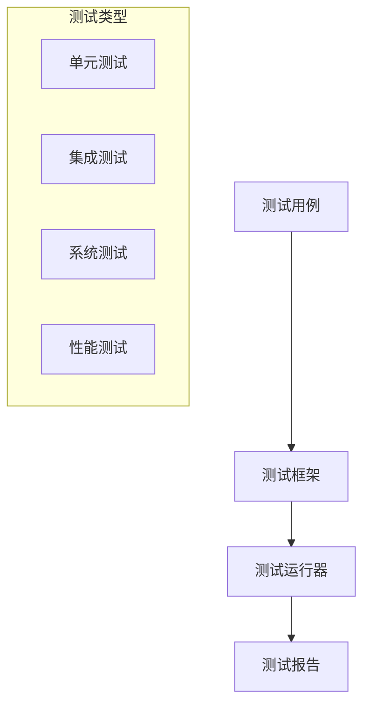

# Zephyr 系统测试指南

## 1. 测试框架概述

### 1.1 测试架构



### 1.2 测试配置

```kconfig
# 测试支持
CONFIG_ZTEST=y
CONFIG_ZTEST_NEW_API=y

# 断言支持
CONFIG_ASSERT=y

# 覆盖率支持
CONFIG_COVERAGE=y
CONFIG_COVERAGE_GCOV=y
```

## 2. 单元测试

### 2.1 基本测试用例

```c
#include <zephyr/ztest.h>

/* 测试套件 */
ZTEST_SUITE(basic_tests, NULL, NULL, NULL, NULL, NULL);

/* 测试用例 */
ZTEST(basic_tests, test_assert)
{
    int a = 1;
    int b = 2;
    
    zassert_true(a < b, "a should be less than b");
    zassert_equal(a + 1, b, "a + 1 should equal b");
    zassert_not_null(&a, "a should not be null");
}

/* 测试功能 */
static int add_numbers(int a, int b)
{
    return a + b;
}

ZTEST(basic_tests, test_add)
{
    zassert_equal(add_numbers(2, 3), 5,
                 "2 + 3 should equal 5");
    zassert_equal(add_numbers(-1, 1), 0,
                 "-1 + 1 should equal 0");
}
```

### 2.2 测试夹具

```c
#include <zephyr/ztest.h>

/* 测试夹具结构 */
struct test_fixture {
    int test_value;
    void *resource;
};

/* 夹具设置 */
static void *setup_fixture(void)
{
    struct test_fixture *fixture;
    
    fixture = malloc(sizeof(struct test_fixture));
    fixture->test_value = 42;
    fixture->resource = malloc(100);
    
    return fixture;
}

/* 夹具清理 */
static void teardown_fixture(void *f)
{
    struct test_fixture *fixture = f;
    
    free(fixture->resource);
    free(fixture);
}

/* 使用夹具的测试套件 */
ZTEST_SUITE(fixture_tests, NULL, setup_fixture,
            NULL, NULL, teardown_fixture);

/* 测试用例 */
ZTEST_F(fixture_tests, test_fixture)
{
    zassert_equal(fixture->test_value, 42,
                 "Fixture value should be 42");
}
```

## 3. 集成测试

### 3.1 设备驱动测试

```c
#include <zephyr/ztest.h>
#include <zephyr/drivers/gpio.h>

/* GPIO驱动测试 */
ZTEST(gpio_tests, test_gpio_config)
{
    const struct device *dev;
    int ret;
    
    dev = device_get_binding("GPIO_0");
    zassert_not_null(dev, "GPIO device not found");
    
    ret = gpio_pin_configure(dev, 10, GPIO_OUTPUT);
    zassert_equal(ret, 0, "GPIO config failed");
}

/* I2C驱动测试 */
ZTEST(i2c_tests, test_i2c_transfer)
{
    const struct device *dev;
    uint8_t data[2] = {0x01, 0x02};
    int ret;
    
    dev = device_get_binding("I2C_0");
    zassert_not_null(dev, "I2C device not found");
    
    ret = i2c_write(dev, data, sizeof(data), 0x50);
    zassert_equal(ret, 0, "I2C write failed");
}
```

### 3.2 协议栈测试

```c
#include <zephyr/ztest.h>
#include <zephyr/net/socket.h>

/* 网络协议测试 */
ZTEST(network_tests, test_socket_creation)
{
    int sock;
    
    sock = socket(AF_INET, SOCK_STREAM, IPPROTO_TCP);
    zassert_true(sock >= 0, "Socket creation failed");
    
    close(sock);
}

/* 蓝牙协议测试 */
ZTEST(bluetooth_tests, test_bt_enable)
{
    int err;
    
    err = bt_enable(NULL);
    zassert_equal(err, 0, "Bluetooth enable failed");
}
```

## 4. 系统测试

### 4.1 系统功能测试

```c
#include <zephyr/ztest.h>
#include <zephyr/kernel.h>

/* 线程测试 */
static void thread_entry(void *p1, void *p2, void *p3)
{
    k_sem_give((struct k_sem *)p1);
}

ZTEST(thread_tests, test_thread_create)
{
    struct k_thread thread;
    struct k_sem sem;
    k_tid_t tid;
    
    k_sem_init(&sem, 0, 1);
    
    tid = k_thread_create(&thread, stack_area,
                         K_THREAD_STACK_SIZEOF(stack_area),
                         thread_entry, &sem, NULL, NULL,
                         K_PRIO_PREEMPT(0), 0, K_NO_WAIT);
    
    zassert_not_null(tid, "Thread creation failed");
    
    /* 等待线程完成 */
    k_sem_take(&sem, K_FOREVER);
}

/* 定时器测试 */
static void timer_handler(struct k_timer *timer)
{
    k_sem_give((struct k_sem *)timer->user_data);
}

ZTEST(timer_tests, test_timer)
{
    struct k_timer timer;
    struct k_sem sem;
    
    k_sem_init(&sem, 0, 1);
    k_timer_init(&timer, timer_handler, NULL);
    timer.user_data = &sem;
    
    k_timer_start(&timer, K_MSEC(100), K_NO_WAIT);
    
    /* 验证定时器触发 */
    zassert_equal(k_sem_take(&sem, K_MSEC(200)), 0,
                 "Timer didn't trigger");
}
```

### 4.2 性能测试

```c
#include <zephyr/ztest.h>
#include <zephyr/timing/timing.h>

ZTEST(performance_tests, test_operation_timing)
{
    uint32_t start_time, end_time;
    uint32_t cycles, ns;
    
    timing_start();
    start_time = timing_counter_get();
    
    /* 执行要测试的操作 */
    for (int i = 0; i < 1000; i++) {
        /* 测试代码 */
    }
    
    end_time = timing_counter_get();
    cycles = timing_cycles_get(&start_time, &end_time);
    ns = timing_cycles_to_ns(cycles);
    
    /* 验证性能要求 */
    zassert_true(ns < 1000000,
                 "Operation took too long");
}
```

## 5. 覆盖率测试

### 5.1 配置覆盖率

```kconfig
CONFIG_COVERAGE=y
CONFIG_COVERAGE_GCOV=y
```

### 5.2 生成覆盖率报告

```bash
# 编译带覆盖率的测试
west build -b qemu_x86 tests/kernel/threads/thread_apis

# 运行测试
west build -t run

# 生成覆盖率报告
gcovr -r . --html -o coverage.html
```

## 6. 自动化测试

### 6.1 测试脚本

```python
#!/usr/bin/env python3

import subprocess
import sys

def run_test(test_name):
    """运行指定的测试"""
    cmd = ['west', 'build', '-b', 'qemu_x86',
           'tests/' + test_name]
    
    # 编译测试
    result = subprocess.run(cmd)
    if result.returncode != 0:
        print(f"Test {test_name} build failed")
        return False
    
    # 运行测试
    cmd = ['west', 'build', '-t', 'run']
    result = subprocess.run(cmd)
    return result.returncode == 0

def main():
    tests = [
        'kernel/threads/thread_apis',
        'kernel/semaphore',
        'kernel/timer'
    ]
    
    failed_tests = []
    
    for test in tests:
        if not run_test(test):
            failed_tests.append(test)
    
    if failed_tests:
        print("Failed tests:", failed_tests)
        sys.exit(1)
    
    print("All tests passed!")

if __name__ == '__main__':
    main()
```

### 6.2 CI/CD集成

```yaml
# .github/workflows/tests.yml
name: Zephyr Tests

on: [push, pull_request]

jobs:
  test:
    runs-on: ubuntu-latest
    
    steps:
    - uses: actions/checkout@v2
    
    - name: Setup Python
      uses: actions/setup-python@v2
      with:
        python-version: '3.8'
    
    - name: Install dependencies
      run: |
        pip install west
        west init -m https://github.com/zephyrproject-rtos/zephyr
        west update
    
    - name: Run tests
      run: |
        ./scripts/run_tests.py
    
    - name: Upload coverage
      uses: actions/upload-artifact@v2
      with:
        name: coverage-report
        path: coverage.html
```

## 7. 测试最佳实践

### 7.1 测试组织

```c
/* 按功能组织测试 */
ZTEST_SUITE(kernel_tests, NULL, NULL, NULL, NULL, NULL);
ZTEST_SUITE(driver_tests, NULL, NULL, NULL, NULL, NULL);
ZTEST_SUITE(network_tests, NULL, NULL, NULL, NULL, NULL);

/* 测试用例命名约定 */
ZTEST(kernel_tests, test_thread_creation)
ZTEST(kernel_tests, test_thread_priority)
ZTEST(kernel_tests, test_thread_scheduling)
```

### 7.2 测试文档

```c
/**
 * @brief 测试线程创建功能
 *
 * 测试目标:
 * - 验证线程创建是否成功
 * - 验证线程优先级设置
 * - 验证线程栈大小配置
 *
 * 测试步骤:
 * 1. 创建新线程
 * 2. 验证线程ID
 * 3. 检查线程状态
 * 4. 等待线程完成
 *
 * 预期结果:
 * - 线程创建成功
 * - 线程正常执行
 * - 线程正常退出
 */
ZTEST(thread_tests, test_thread_create)
{
    /* 测试实现 */
}
```

## 8. 调试测试失败

### 8.1 测试调试工具

```c
#include <zephyr/ztest.h>

/* 测试辅助宏 */
#define TEST_CHECK(condition, fmt, ...) \
    do { \
        if (!(condition)) { \
            ztest_test_fail(); \
            printk("Check failed: " fmt "\n", ##__VA_ARGS__); \
        } \
    } while (0)

/* 带调试信息的测试 */
ZTEST(debug_tests, test_with_debug)
{
    int value = calculate_something();
    
    TEST_CHECK(value == expected_value,
              "Value %d != expected %d",
              value, expected_value);
}
```

### 8.2 测试日志分析

```c
#include <zephyr/ztest.h>
#include <zephyr/logging/log.h>

LOG_MODULE_REGISTER(test_log, LOG_LEVEL_DBG);

ZTEST(log_tests, test_with_logging)
{
    LOG_INF("Starting test");
    
    /* 测试步骤 */
    int result = perform_operation();
    LOG_DBG("Operation result: %d", result);
    
    /* 验证结果 */
    zassert_equal(result, expected_result,
                 "Operation failed");
    
    LOG_INF("Test completed");
}
```